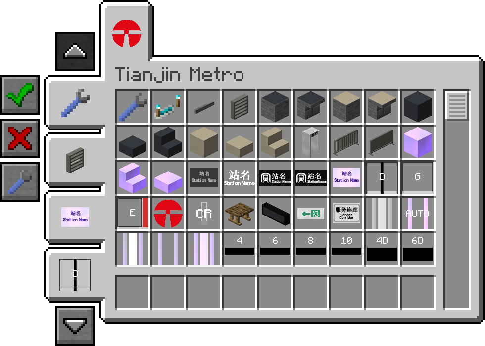

# Filters API

Filters API is an easy-to-use, open, complete library, that provides a filtering system to categorize your mod's creative tab.

Filters API makes it easy to find an item by adding new filter tabs to the left side of the creative screen that allow you to limit the items shown based on the category they fall under. Filters API also supports collecting uncategorized items to the uncategorized filter, to avoid uncategorized items disappearing from the tab.

Inspired by [Filters Mod](https://github.com/MrCrayfish/Filters) and [MrCrayfish's Furniture Mod](https://github.com/MrCrayfish/MrCrayfishFurnitureMod).